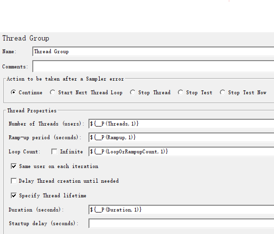

# rmeter_workspace
rmeter_workspace是一系列的命令行工具，用于减少用JMeter做性能测试时一些繁琐的操作，比如：清除上一次测试结果、使用nmon工具监控各服务器系统资源、下载nmon监控数据文件、快速分析nmon数据文件、按时间或备注归档当前测试结果。

包含以下命令行工具：
* rmeter, 用于组织调用其他命令行工具，包括rnmon、rssh、jmeter。随带对生成的文件或目录进行归档。
* rssh, 用于在各服务器上批量执行命令，比如：新建工作目录、发起nmon监控、下载nmon监控数据文件、上传文件等。
* rnmon, 用于快速分析nmon数据文件，生成HMTL的图表。
* rscript, 辅助在windows上开发JMeter脚本。

# CLI
```shell
rmeter -h
使用rmeter，减少使用JMeter CLI MOD压测时的一些重复性操作，让我们更关注结果本身

Usage: rmeter.exe [OPTIONS] --jmxfile <FILE>

Options:
      --logfile <FILE>  指定一个日志输出文件(追加)，默认nmon、ssh子命令只输出dubug级别控制台的日志，jmeter子命令输出info日志到控制台和日志文件 [default: run.log]
      --debug...        一个开启DEBUG日志，两个及以上开启trace日志
  -h, --help            Print help (see more with '--help')
  -V, --version         Print version

JMeter:
  -j, --jmxfile <FILE>

  -t, --thread-num <THREAD_NUM>
          与jmeter -JThreads=<num> 等价 [default: 1]
  -r, --rampup <RAMPUP>
          线程加载时间，单位：秒。 与jmeter -JRampup=<sesc> 等价 [default: 1]
  -c, --count <COUNT>
          1. Thread Group线程组时，代表: Loop Count , 有效值>=-1。 2. Concurrency Thread Group线程组时，代表： Ramp-Up Steps Count , 有效值>=1。 与jmeter -JLoopOrRampupCount=<count> 等价 [default: -1]
  -d, --duration <DURATION>
          线程加载完后的运行时间。 与jmeter -JDuration=<sesc> 等价 [default: 1]
  -p, --propfile <FILE>
          测试配置文件，常用用但不咋个改的配置。若不指定，则使用rmeter内置的配置信息。 与jmeter -Jkey1=value1 -Jkey2=value2 等价, key和value均为配置文件里的值 [default: test.properties]
  -J, --jmeterproperty <JMETERPROPERTY>
          JMeter -J<argument>=<value> Define additional JMeter properties。 与jmeter -Jkey1=value1 等价，命令行传入的参数，会覆盖配置文件里的参数。
  -o, --outputfolder <OUTPUTFOLDER>
          重命名输出目录，输入信息包含：JMeter的产物（JTL文件，jmeter.log，jmeter运行结束后的HTML报告目录），NMON监控产物（nmon文件，nmon生成的HTML文件）和一些三方依赖包。 默认，按月日时分的时间戳_JMeter部分输出信息（比如：0313-2212_1qps2ms0err）
      --append <APPEND>
          输出目录后附加一段备注说明，比如输出目录为: 0313-2212_1qps2ms0err_test1，则append为test1

Ssh:
      --nmon           设置nmon监控，要求工作目录存在server.json文件
      --nowait         发起nmon监控时，设置是否立即执行JMeter，还是等发起nmon监控(data mode)的命令执行完（注意一般而言发起nmon监控的命令会马上返回，但偶尔因nmon版本太老，在rssh命令调用时无法马上返回）
      --nmondir <DIR>  服务器上nmon结果存放的目录，也是识别nmon进程的标识，尽量唯一，只有当-nmon 生效的时候才需要 [default: perf]

Nmon:
      --html          对输入的nmon文件进行分析，并生成HTML图表，当指定html时cpu默认为true
      --cpu           分析nmon文件时，设置对cpu使用进行分析
      --disk-busy     分析nmon文件时，设置对disk_busy使用进行分析
      --mem-free      分析nmon文件时，设置对mem使用进行分析
      --mem-active    分析nmon文件时，设置对mem使用进行分析
      --mem-swap      分析nmon文件时，设置对mem使用进行分析
      --jfsfile       分析nmon文件时，设置对jfsfile使用进行分析
      --disk-io       分析nmon文件时，设置对disk_io使用进行分析，暂不支持todo
      --disk-summary  分析nmon文件时，设置对disk_summary使用进行分析，暂不支持todo
      --net           分析nmon文件时，设置对net使用进行分析，不支持todo
```

# Examples
## Prerequisite
rmeter命令依赖于JMeter脚本，对其线程组有些要求。
1. 支持JMeter的线程组类型：**Thread Group** 和 **Concurrency Thread Group**
2. 适当的在JMeter线程组中使用JMeter函数: 

|rmeter选项|rmeter选项默认值|JMeter函数|JMeter函数默认值|备注|
|---|---|---|---|---|
|-t|1|**\${__P(Threads,1)}**|1|目标线程数|
|-r|1|**\${__P(Rampup,1)}**|1|目标线程数加载时间|
|-c|-1|**\${__P(LoopOrRampupCount,1)}**|1|循环次数或者目标线程数加载次数|
|-d|1|**\${__P(Duration,1)}**|1|目标线程数加载完成后JMeter持续运行时间（秒）|



## Thread Group 线程组示例
1. 使用1.jmx脚本，1个线程运行10秒: **rmeter -j 1.jmx -t 1 -d 10**
2. 使用1.jmx脚本，10个线程运行100次，最多持续5分钟: **rmeter -j 1.jmx -t 10 -c 100 -d 300**
3. 使用1.jmx脚本，10个线程运行5分钟: **rmeter -j 1.jmx -t 10 -d 300**
以上示例
* 运行中在当前目录生成格式**MMdd-HHmm**的目录，用于存放JMeter运行时生成的jmeter.log、JTL文件。 如：`1122-1430`
* 正常运行结束后，rmeter会读取JMeter生成HTML报告中的**statistics.json**文件，并重命名以上目录格式为: **MMdd-HHmm_?qps?ms?err**， 如:`1122-1430_1qps2ms0err`，代表11月22日14点30分运行的测试，该测试总的Throughput为1，平均响应时间为2ms，错误的请求数为0。

## 监控系统资源
原理：利用ssh连接到远程服务器上运行nmon命令，以监控各系统资源使用情况，如CPU、IO等。
要求：与rmeter命令的工作目录中，配置**server.json**文件，模板内容如下：
```json
{
  "groups": [
    {
      "name": "模板", "members": [
        { "hostname": "tmp", "ip": "127.0.0.1", "port": 22, "user": "username", "auth": { "Password": "password" }, "valid": true },
        { "hostname": "tmp", "ip": "127.0.0.1", "port": 22, "user": "username", "auth": "LocalSsh", "valid": true }
      ], "valid": false },
    { "name": "test",
      "members": [
        { "hostname": "app", "ip": "127.0.0.1", "port": 22, "user": "username", "auth": { "Password": "password" }, "valid": true },
        { "hostname": "db", "ip": "127.0.0.2", "port": 22, "user": "username", "auth": { "Password": "password" }, "valid": true }
      ], "valid": true }
  ]
}
```
* auth字段值为Password时，rmeter命令调用rssh命令使用async-ssh2-tokio库，使用用户名和密码的方式连接各服务器，并在服务器上新建目录（如:~/perf/1122-1430），并执行 nmon -F ~/perf/1122-1430/res.nmon -s 时间间隔 -c 数据收集次数，测试结束时下载res.nmon文件到本地，并利用rnmon工具分析各nmon数据文件并生成HTML图表。
* auth字段值为"LocalSsh"时，rmeter命令调用本地的ssh和scp命令，完成上述的操作。前提是配置免密登录各服务器的方式
示例命令如：**rmeter -j 1.jmx -t 10 -d 300 --nmon --html --cpu --mem-free --mem-active --mem-swap --jfsfile --disk-busy**
上述命令运行后，打开如: **1122-1430_1qps2ms0err/index_nmons.html** 的图表，即可查看各系统资源使用情况
